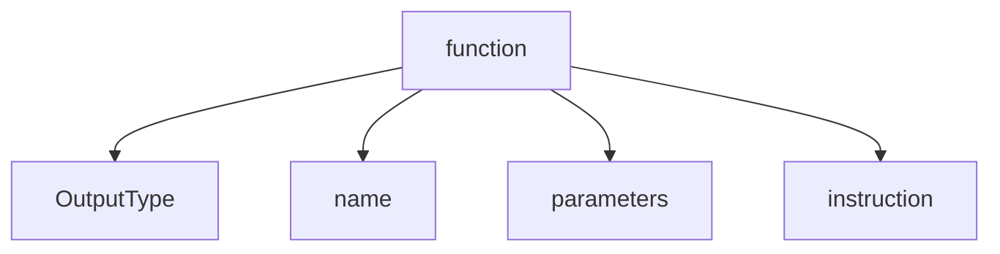

# Getting start in C
## First Program  
* objectif : retourner `Hello, world`

## Steps
* Importer stdio.h
* Rédiger une fonction main

### Importer une librairie C
* mot clé : `#include [lib c]`

### Développer une fonction
* composition d'une fonction

* **OutputType** : Type attendu à la sortie d'une fonction C.
* **name** : Nom de la fonction.
* **parameters** : Données requises au fonctionnement de la fonction.
* **instruction** : Implémentation logique accomplissant une action machine.

### example
```c 
#include <stdio.h>

int main(void)
{
    printf("Hello, world\n")
}
```
