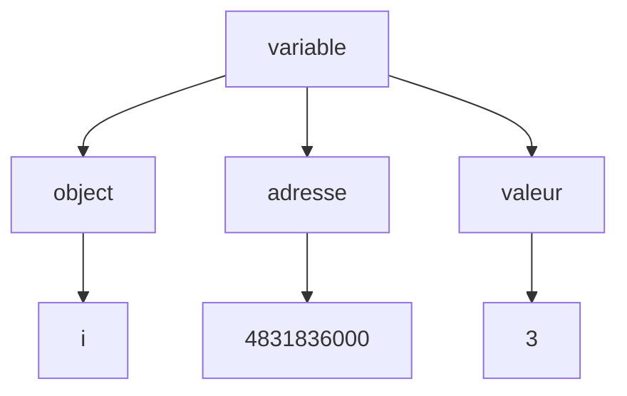
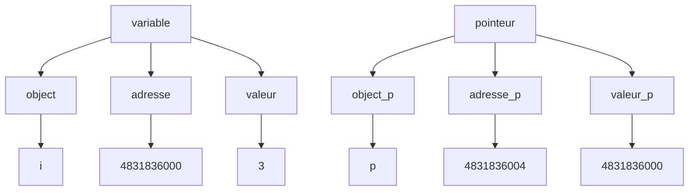

# Pointeurs in C
> Les variables déclarées sont stockées en mémoire centrale. Cette même mémoire est composée d'octets idientifiable par ce qu'on appelle une *adrese*.

* Pour retrouver une variable, il faut connaître l'adresse. 
* Le nom de variable est son idendantificateur, le compilateur fait le lien entre le nom de variable et son adresse.


---
une adresse à un type LONG (64 bits)
---

* L'opératuer & permet d'accéder à l'adresse mémoire
  * son retour est une constante, elle ne peut pas être modifé par une affectation <br>`variable = expression`

* un pointeur est un objet dont la valeur est égale à l'adresse mémoire.
  * `type *foo`



Exemple type : 
```c
main()
{
    int i = 3;
    int *p;

    p = &i;
    printf("*p = %d \n, *p");
}
```

|name|type|e|
|--|--|--|
|i|int|3|
|*p|int|3 (accède à l'adresse mémoire contenu dans p)|
|p|pointer|4831836000|
